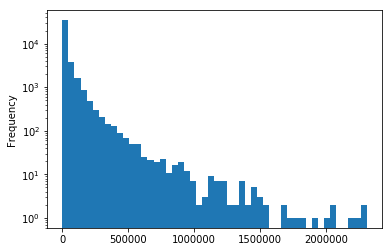
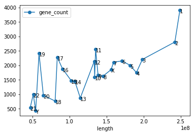

R and Python comparison
- https://shiring.github.io/r_vs_python/2017/01/22/R_vs_Py_post
- Python codes
- Ref R codes: http://211.239.124.233:11602/notebooks/Dev/R_study/R%20vs%20Python%20-%20R%20codes.ipynb
- mgmt by git


library load


```python
from IPython.core.display import display, HTML
display(HTML("<style>.container { width:100% !important; }</style>"))
```


<style>.container { width:100% !important; }</style>


```python
import pandas as pd
```

reading data

Reading in data is straight forward in both R and Python. The code we need to read in the file is comparable between R and Python. Zhuyi Xue specified “compression = ‘gzip’”, but this would not have been necessary as the default is to infer it from the file suffix.

One big difference in the general syntax we can see here too: Boolean true/false values are written in all caps in R (TRUE/FALSE), while Python uses first letter capitalisation (True/False). The same prinicple applies to “none”.


```python
df = pd.read_csv('Homo_sapiens.GRCh38.85.gff3.gz',
                compression = 'gzip',
                 sep='\t',
                 comment = '#',
                 low_memory = False,
                 header = None,
                 names = ['seqid','source', 'type','start','end','score','strand','phase','attributes']
                )
df.head()
```


<div>
<style scoped>
    .dataframe tbody tr th:only-of-type {
        vertical-align: middle;
    }

    .dataframe tbody tr th {
        vertical-align: top;
    }

    .dataframe thead th {
        text-align: right;
    }
</style>
<table border="1" class="dataframe">
  <thead>
    <tr style="text-align: right;">
      <th></th>
      <th>seqid</th>
      <th>source</th>
      <th>type</th>
      <th>start</th>
      <th>end</th>
      <th>score</th>
      <th>strand</th>
      <th>phase</th>
      <th>attributes</th>
    </tr>
  </thead>
  <tbody>
    <tr>
      <th>0</th>
      <td>1</td>
      <td>GRCh38</td>
      <td>chromosome</td>
      <td>1</td>
      <td>248956422</td>
      <td>.</td>
      <td>.</td>
      <td>.</td>
      <td>ID=chromosome:1;Alias=CM000663.2,chr1,NC_00000...</td>
    </tr>
    <tr>
      <th>1</th>
      <td>1</td>
      <td>.</td>
      <td>biological_region</td>
      <td>10469</td>
      <td>11240</td>
      <td>1.3e+03</td>
      <td>.</td>
      <td>.</td>
      <td>external_name=oe %3D 0.79;logic_name=cpg</td>
    </tr>
    <tr>
      <th>2</th>
      <td>1</td>
      <td>.</td>
      <td>biological_region</td>
      <td>10650</td>
      <td>10657</td>
      <td>0.999</td>
      <td>+</td>
      <td>.</td>
      <td>logic_name=eponine</td>
    </tr>
    <tr>
      <th>3</th>
      <td>1</td>
      <td>.</td>
      <td>biological_region</td>
      <td>10655</td>
      <td>10657</td>
      <td>0.999</td>
      <td>-</td>
      <td>.</td>
      <td>logic_name=eponine</td>
    </tr>
    <tr>
      <th>4</th>
      <td>1</td>
      <td>.</td>
      <td>biological_region</td>
      <td>10678</td>
      <td>10687</td>
      <td>0.999</td>
      <td>+</td>
      <td>.</td>
      <td>logic_name=eponine</td>
    </tr>
  </tbody>
</table>
</div>


examining data
- listing unique values

The first thing we want to know from the data is how many unique entries there are in the “seqid” column.
Here, we can already see the main difference in syntax between R and Python:

Python concatenates the object name (“df) with the column name and the functions that we want to run on this column in a sequential manner, separated by a dot. Base R uses nested functions, where each function is called with “function_name()” and we specify columns with “object_name$column_name”.

However, both R and Python can also call columns in a dataframe with “[ ]” with the difference that Python per default subsets data columns df[“seqid”], while R always needs index specifications for rows and columns, separated by “,”: e.g. df[, “seqid”] would subset every row and only the column named “seqid”.

The sequential calling of functions is indeed very handy, it makes the code easier to read and understand than lots of interwoven functions and brackets. But while this isn’t the concept of base R, dplyr uses the magrittr principle of chaining functions with the pipe symbol “%>%”. Even though this symbol isn’t as easily typed, it’s functionality is often superior to base R, especially if you need to run many functions on a dataframe. However, with just or two functions, I usually keep to base R as it is shorter.


```python
df.seqid.unique()
```


    array(['1', '10', '11', '12', '13', '14', '15', '16', '17', '18', '19',
           '2', '20', '21', '22', '3', '4', '5', '6', '7', '8', '9',
           'GL000008.2', 'GL000009.2', 'GL000194.1', 'GL000195.1',
           'GL000205.2', 'GL000208.1', 'GL000213.1', 'GL000214.1',
           'GL000216.2', 'GL000218.1', 'GL000219.1', 'GL000220.1',
           'GL000221.1', 'GL000224.1', 'GL000225.1', 'GL000226.1',
           'KI270302.1', 'KI270303.1', 'KI270304.1', 'KI270305.1',
           'KI270310.1', 'KI270311.1', 'KI270312.1', 'KI270315.1',
           'KI270316.1', 'KI270317.1', 'KI270320.1', 'KI270322.1',
           'KI270329.1', 'KI270330.1', 'KI270333.1', 'KI270334.1',
           'KI270335.1', 'KI270336.1', 'KI270337.1', 'KI270338.1',
           'KI270340.1', 'KI270362.1', 'KI270363.1', 'KI270364.1',
           'KI270366.1', 'KI270371.1', 'KI270372.1', 'KI270373.1',
           'KI270374.1', 'KI270375.1', 'KI270376.1', 'KI270378.1',
           'KI270379.1', 'KI270381.1', 'KI270382.1', 'KI270383.1',
           'KI270384.1', 'KI270385.1', 'KI270386.1', 'KI270387.1',
           'KI270388.1', 'KI270389.1', 'KI270390.1', 'KI270391.1',
           'KI270392.1', 'KI270393.1', 'KI270394.1', 'KI270395.1',
           'KI270396.1', 'KI270411.1', 'KI270412.1', 'KI270414.1',
           'KI270417.1', 'KI270418.1', 'KI270419.1', 'KI270420.1',
           'KI270422.1', 'KI270423.1', 'KI270424.1', 'KI270425.1',
           'KI270429.1', 'KI270435.1', 'KI270438.1', 'KI270442.1',
           'KI270448.1', 'KI270465.1', 'KI270466.1', 'KI270467.1',
           'KI270468.1', 'KI270507.1', 'KI270508.1', 'KI270509.1',
           'KI270510.1', 'KI270511.1', 'KI270512.1', 'KI270515.1',
           'KI270516.1', 'KI270517.1', 'KI270518.1', 'KI270519.1',
           'KI270521.1', 'KI270522.1', 'KI270528.1', 'KI270529.1',
           'KI270530.1', 'KI270538.1', 'KI270539.1', 'KI270544.1',
           'KI270548.1', 'KI270579.1', 'KI270580.1', 'KI270581.1',
           'KI270582.1', 'KI270583.1', 'KI270584.1', 'KI270587.1',
           'KI270588.1', 'KI270589.1', 'KI270590.1', 'KI270591.1',
           'KI270593.1', 'KI270706.1', 'KI270707.1', 'KI270708.1',
           'KI270709.1', 'KI270710.1', 'KI270711.1', 'KI270712.1',
           'KI270713.1', 'KI270714.1', 'KI270715.1', 'KI270716.1',
           'KI270717.1', 'KI270718.1', 'KI270719.1', 'KI270720.1',
           'KI270721.1', 'KI270722.1', 'KI270723.1', 'KI270724.1',
           'KI270725.1', 'KI270726.1', 'KI270727.1', 'KI270728.1',
           'KI270729.1', 'KI270730.1', 'KI270731.1', 'KI270732.1',
           'KI270733.1', 'KI270734.1', 'KI270735.1', 'KI270736.1',
           'KI270737.1', 'KI270738.1', 'KI270739.1', 'KI270740.1',
           'KI270741.1', 'KI270742.1', 'KI270743.1', 'KI270744.1',
           'KI270745.1', 'KI270746.1', 'KI270747.1', 'KI270748.1',
           'KI270749.1', 'KI270750.1', 'KI270751.1', 'KI270752.1',
           'KI270753.1', 'KI270754.1', 'KI270755.1', 'KI270756.1',
           'KI270757.1', 'MT', 'X', 'Y'], dtype=object)


* how many unique values are there

* To get the number of unique entries in the “seqid” column, we simply need to append “.shape” to the above Python code. In R, we can either wrap the above R code with the “length()” function or use dplyr and piping instead. If we use the latter, we need to use the “nrow()” function because base R returns a vector, while dplyr returns a dataframe. Here, we can see that with two functions, using dplyr is still a bit more code but it already looks much tidier.


```python
df.seqid.unique().shape
```


    (194,)


* counting occurrences

* To count the frequencies of each unique entry in the “source” column, we use the “value_counts()” function in Python and the “table()” function in R. These two functions differ in how they sort the output table: value_counts() sorts by decreasing frequency, while R alphabetically sorts the variables. To order the data as in Python, we need to add the “sort()” function to our R code.


```python
df.source.value_counts()
```


    havana            1441093
    ensembl_havana     745065
    ensembl            228212
    .                  182510
    mirbase              4701
    GRCh38                194
    insdc                  74
    Name: source, dtype: int64


How much of the Genome is incomplete
- subsetting a dataframe

We are now subsetting our original dataframe and assign it a new object name with “ = “ or “ <- “.

To subset the dataframe to keep only rows which say “GRCh38” in the “source” column, ther are several ways to do this in R: the way that would be directly comparable to how it was done in Python would be to also use the square bracket indexing. However, there are two solutions which are more elegant: 1) base R’s “subset()” or dplyr’s “filter()” function. But with this short example, there is no big difference between the three.

Python’s “shape” gives us the same information as R’s “dim()” function: how many rows and columns our dataframe has.

To preview a random subset of 10 rows from our dataframe, we use Python’s “sample()” and dplyr’s “sample_n()” function.


```python
# filter
gdf = df[df.source == "GRCh38"]
# dim()
gdf.shape
# sample_n()
gdf.sample(10)
```


<div>
<style scoped>
    .dataframe tbody tr th:only-of-type {
        vertical-align: middle;
    }

    .dataframe tbody tr th {
        vertical-align: top;
    }

    .dataframe thead th {
        text-align: right;
    }
</style>
<table border="1" class="dataframe">
  <thead>
    <tr style="text-align: right;">
      <th></th>
      <th>seqid</th>
      <th>source</th>
      <th>type</th>
      <th>start</th>
      <th>end</th>
      <th>score</th>
      <th>strand</th>
      <th>phase</th>
      <th>attributes</th>
    </tr>
  </thead>
  <tbody>
    <tr>
      <th>2511463</th>
      <td>KI270317.1</td>
      <td>GRCh38</td>
      <td>supercontig</td>
      <td>1</td>
      <td>37690</td>
      <td>.</td>
      <td>.</td>
      <td>.</td>
      <td>ID=supercontig:KI270317.1;Alias=chrUn_KI270317...</td>
    </tr>
    <tr>
      <th>2511455</th>
      <td>KI270303.1</td>
      <td>GRCh38</td>
      <td>supercontig</td>
      <td>1</td>
      <td>1942</td>
      <td>.</td>
      <td>.</td>
      <td>.</td>
      <td>ID=supercontig:KI270303.1;Alias=chrUn_KI270303...</td>
    </tr>
    <tr>
      <th>2513996</th>
      <td>KI270755.1</td>
      <td>GRCh38</td>
      <td>supercontig</td>
      <td>1</td>
      <td>36723</td>
      <td>.</td>
      <td>.</td>
      <td>.</td>
      <td>ID=supercontig:KI270755.1;Alias=chrUn_KI270755...</td>
    </tr>
    <tr>
      <th>2511465</th>
      <td>KI270322.1</td>
      <td>GRCh38</td>
      <td>supercontig</td>
      <td>1</td>
      <td>21476</td>
      <td>.</td>
      <td>.</td>
      <td>.</td>
      <td>ID=supercontig:KI270322.1;Alias=chrUn_KI270322...</td>
    </tr>
    <tr>
      <th>2511473</th>
      <td>KI270338.1</td>
      <td>GRCh38</td>
      <td>supercontig</td>
      <td>1</td>
      <td>1428</td>
      <td>.</td>
      <td>.</td>
      <td>.</td>
      <td>ID=supercontig:KI270338.1;Alias=chrUn_KI270338...</td>
    </tr>
    <tr>
      <th>2511547</th>
      <td>KI270507.1</td>
      <td>GRCh38</td>
      <td>supercontig</td>
      <td>1</td>
      <td>5353</td>
      <td>.</td>
      <td>.</td>
      <td>.</td>
      <td>ID=supercontig:KI270507.1;Alias=chrUn_KI270507...</td>
    </tr>
    <tr>
      <th>2511551</th>
      <td>KI270511.1</td>
      <td>GRCh38</td>
      <td>supercontig</td>
      <td>1</td>
      <td>8127</td>
      <td>.</td>
      <td>.</td>
      <td>.</td>
      <td>ID=supercontig:KI270511.1;Alias=chrUn_KI270511...</td>
    </tr>
    <tr>
      <th>2512300</th>
      <td>KI270721.1</td>
      <td>GRCh38</td>
      <td>supercontig</td>
      <td>1</td>
      <td>100316</td>
      <td>.</td>
      <td>.</td>
      <td>.</td>
      <td>ID=supercontig:KI270721.1;Alias=chr11_KI270721...</td>
    </tr>
    <tr>
      <th>2511457</th>
      <td>KI270305.1</td>
      <td>GRCh38</td>
      <td>supercontig</td>
      <td>1</td>
      <td>1472</td>
      <td>.</td>
      <td>.</td>
      <td>.</td>
      <td>ID=supercontig:KI270305.1;Alias=chrUn_KI270305...</td>
    </tr>
    <tr>
      <th>2511479</th>
      <td>KI270371.1</td>
      <td>GRCh38</td>
      <td>supercontig</td>
      <td>1</td>
      <td>2805</td>
      <td>.</td>
      <td>.</td>
      <td>.</td>
      <td>ID=supercontig:KI270371.1;Alias=chrUn_KI270371...</td>
    </tr>
  </tbody>
</table>
</div>


* creating new columns and performing calculations

Now we want to create a new column called “length”. It should contain the gene lengths, i.e. the distance in base pairs between the start and end point on the chromosomes (“start” and “end” columns). In R we don’t need to copy the dataframe first but the rest of the code is very similar: we define a new column name for the dataframe and assign its value by subtracting the values of the “start” from the values of the “end” column (+1). Here, we can see again that in Python we use a dot to define columns, while R uses the Dollar sign.


```python
gdf = gdf.copy()
gdf['length'] = gdf.end - gdf.start + 1
gdf.length.sum()
```


    3096629726


* complex condition filtering and calculation

Next, we want to calculating the proportion of the genome that is not on main chromosome assemblies. For that, we first define a character string with the main chromosomes: 1 to 23, X, Y and MT (mitochondrial chromosome). Defining this string is a bit easier in R.

We will use this string to calculate the sum of lengths of the subsetted dataframe and divide it by the sum of lengths of the whole dataframe. For subsetting, we use the “isin()” function of Python, which corresponds to R’s “%in%”.


```python
chrs = [str(_) for _ in range(1,23)] + ['X', 'Y', "MT"]
gdf[-gdf.seqid.isin(chrs)].length.sum() / gdf.length.sum()
```


    0.0037021917421198327


* How many Genes are there?

Here, we are again using the same functions as above for subsetting the dataframe, asking for its dimensions, printing 10 random lines and asking for the frequencies of each unique item in the “type” column. For the latter I am using base R over dplyr, because it’s faster to type.


```python
edf = df[df.source.isin(['ensembl','havana','ensembl_havana'])]
edf.shape

edf.sample(10)
edf.type.value_counts()
```


    exon                             1180596
    CDS                               704604
    five_prime_UTR                    142387
    three_prime_UTR                   133938
    transcript                         96375
    gene                               42470
    processed_transcript               28228
    aberrant_processed_transcript      26944
    NMD_transcript_variant             13761
    lincRNA                            13247
    processed_pseudogene               10722
    lincRNA_gene                        7533
    pseudogene                          3049
    RNA                                 2221
    snRNA_gene                          1909
    snRNA                               1909
    snoRNA                               956
    snoRNA_gene                          944
    pseudogenic_transcript               737
    rRNA_gene                            549
    rRNA                                 549
    miRNA                                302
    V_gene_segment                       216
    J_gene_segment                       158
    VD_gene_segment                       37
    C_gene_segment                        29
    Name: type, dtype: int64


Now we want to subset the dataframe to rows with the attribute “gene” in the “type” column, look at 10 random lines from the “attributes” column and get the dataframe dimensions.


```python
ndf = edf[edf.type == 'gene']
ndf = ndf.copy()
ndf.sample(10).attributes.values
ndf.shape
```


    (42470, 9)


* extracting gene information from attributes field

I don’t know if there is an easier way in Python but in R we don’t need to create big helper functions around it. We can simply use “gsub()” with defining the regular expression for what we want to extract. This makes the R code much shorter and easier to understand! We then drop the original “attributes” column.

To have a look at the dataframe, we use “head()” this time.


```python
import re

RE_GENE_NAME = re.compile(r'Name=(?P<gene_name>.+?);')
def extract_gene_name(attributes_str):
    res = RE_GENE_NAME.search(attributes_str)
    return res.group('gene_name')


ndf['gene_name'] = ndf.attributes.apply(extract_gene_name)

RE_GENE_ID = re.compile(r'gene_id=(?P<gene_id>ENSG.+?);')
def extract_gene_id(attributes_str):
    res = RE_GENE_ID.search(attributes_str)
    return res.group('gene_id')


ndf['gene_id'] = ndf.attributes.apply(extract_gene_id)


RE_DESC = re.compile('description=(?P<desc>.+?);')
def extract_description(attributes_str):
    res = RE_DESC.search(attributes_str)
    if res is None:
        return ''
    else:
        return res.group('desc')


ndf['desc'] = ndf.attributes.apply(extract_description)

ndf.drop('attributes', axis=1, inplace=True)
ndf.head()


```


<div>
<style scoped>
    .dataframe tbody tr th:only-of-type {
        vertical-align: middle;
    }

    .dataframe tbody tr th {
        vertical-align: top;
    }

    .dataframe thead th {
        text-align: right;
    }
</style>
<table border="1" class="dataframe">
  <thead>
    <tr style="text-align: right;">
      <th></th>
      <th>seqid</th>
      <th>source</th>
      <th>type</th>
      <th>start</th>
      <th>end</th>
      <th>score</th>
      <th>strand</th>
      <th>phase</th>
      <th>gene_name</th>
      <th>gene_id</th>
      <th>desc</th>
    </tr>
  </thead>
  <tbody>
    <tr>
      <th>16</th>
      <td>1</td>
      <td>havana</td>
      <td>gene</td>
      <td>11869</td>
      <td>14409</td>
      <td>.</td>
      <td>+</td>
      <td>.</td>
      <td>DDX11L1</td>
      <td>ENSG00000223972</td>
      <td>DEAD/H-box helicase 11 like 1 [Source:HGNC Sym...</td>
    </tr>
    <tr>
      <th>28</th>
      <td>1</td>
      <td>havana</td>
      <td>gene</td>
      <td>14404</td>
      <td>29570</td>
      <td>.</td>
      <td>-</td>
      <td>.</td>
      <td>WASH7P</td>
      <td>ENSG00000227232</td>
      <td>WAS protein family homolog 7 pseudogene [Sourc...</td>
    </tr>
    <tr>
      <th>71</th>
      <td>1</td>
      <td>havana</td>
      <td>gene</td>
      <td>52473</td>
      <td>53312</td>
      <td>.</td>
      <td>+</td>
      <td>.</td>
      <td>OR4G4P</td>
      <td>ENSG00000268020</td>
      <td>olfactory receptor family 4 subfamily G member...</td>
    </tr>
    <tr>
      <th>74</th>
      <td>1</td>
      <td>havana</td>
      <td>gene</td>
      <td>62948</td>
      <td>63887</td>
      <td>.</td>
      <td>+</td>
      <td>.</td>
      <td>OR4G11P</td>
      <td>ENSG00000240361</td>
      <td>olfactory receptor family 4 subfamily G member...</td>
    </tr>
    <tr>
      <th>77</th>
      <td>1</td>
      <td>ensembl_havana</td>
      <td>gene</td>
      <td>69091</td>
      <td>70008</td>
      <td>.</td>
      <td>+</td>
      <td>.</td>
      <td>OR4F5</td>
      <td>ENSG00000186092</td>
      <td>olfactory receptor family 4 subfamily F member...</td>
    </tr>
  </tbody>
</table>
</div>


Next, we want to know how many unique gene names and gene IDs there are. As above we use the “unique()”, “shape()” (Python) and “length()” (R) functions.

The count table for gene names can again be obtained with R’s “table()” function, even though Zhuyi Xue uses a slightly different approach: he first groups the “gene_name” column, then counts and sorts.

Finally, we can calculate the proportion of genes that have more than appear more than once and we can have a closer look at the SCARNA20 gene.


```python
ndf.shape
# ndf.gene_id.unique().shape #42470
ndf.gene_name.unique().shape #42387

count_df = ndf.groupby('gene_name').count().iloc[:,0].sort_values().iloc[::-1]
count_df.head(10)

count_df[count_df >1].shape
count_df.shape

count_df[count_df >1].shape[0] / count_df.shape[0]

ndf[ndf.gene_name == 'SCARNA20']

```


<div>
<style scoped>
    .dataframe tbody tr th:only-of-type {
        vertical-align: middle;
    }

    .dataframe tbody tr th {
        vertical-align: top;
    }

    .dataframe thead th {
        text-align: right;
    }
</style>
<table border="1" class="dataframe">
  <thead>
    <tr style="text-align: right;">
      <th></th>
      <th>seqid</th>
      <th>source</th>
      <th>type</th>
      <th>start</th>
      <th>end</th>
      <th>score</th>
      <th>strand</th>
      <th>phase</th>
      <th>gene_name</th>
      <th>gene_id</th>
      <th>desc</th>
    </tr>
  </thead>
  <tbody>
    <tr>
      <th>179399</th>
      <td>1</td>
      <td>ensembl</td>
      <td>gene</td>
      <td>171768070</td>
      <td>171768175</td>
      <td>.</td>
      <td>+</td>
      <td>.</td>
      <td>SCARNA20</td>
      <td>ENSG00000253060</td>
      <td>Small Cajal body specific RNA 20 [Source:RFAM%...</td>
    </tr>
    <tr>
      <th>201037</th>
      <td>1</td>
      <td>ensembl</td>
      <td>gene</td>
      <td>204727991</td>
      <td>204728106</td>
      <td>.</td>
      <td>+</td>
      <td>.</td>
      <td>SCARNA20</td>
      <td>ENSG00000251861</td>
      <td>Small Cajal body specific RNA 20 [Source:RFAM%...</td>
    </tr>
    <tr>
      <th>349203</th>
      <td>11</td>
      <td>ensembl</td>
      <td>gene</td>
      <td>8555016</td>
      <td>8555146</td>
      <td>.</td>
      <td>+</td>
      <td>.</td>
      <td>SCARNA20</td>
      <td>ENSG00000252778</td>
      <td>Small Cajal body specific RNA 20 [Source:RFAM%...</td>
    </tr>
    <tr>
      <th>718520</th>
      <td>14</td>
      <td>ensembl</td>
      <td>gene</td>
      <td>63479272</td>
      <td>63479413</td>
      <td>.</td>
      <td>+</td>
      <td>.</td>
      <td>SCARNA20</td>
      <td>ENSG00000252800</td>
      <td>Small Cajal body specific RNA 20 [Source:RFAM%...</td>
    </tr>
    <tr>
      <th>837233</th>
      <td>15</td>
      <td>ensembl</td>
      <td>gene</td>
      <td>75121536</td>
      <td>75121666</td>
      <td>.</td>
      <td>-</td>
      <td>.</td>
      <td>SCARNA20</td>
      <td>ENSG00000252722</td>
      <td>Small Cajal body specific RNA 20 [Source:RFAM%...</td>
    </tr>
    <tr>
      <th>1039874</th>
      <td>17</td>
      <td>ensembl</td>
      <td>gene</td>
      <td>28018770</td>
      <td>28018907</td>
      <td>.</td>
      <td>+</td>
      <td>.</td>
      <td>SCARNA20</td>
      <td>ENSG00000251818</td>
      <td>Small Cajal body specific RNA 20 [Source:RFAM%...</td>
    </tr>
    <tr>
      <th>1108215</th>
      <td>17</td>
      <td>ensembl</td>
      <td>gene</td>
      <td>60231516</td>
      <td>60231646</td>
      <td>.</td>
      <td>-</td>
      <td>.</td>
      <td>SCARNA20</td>
      <td>ENSG00000252577</td>
      <td>small Cajal body-specific RNA 20 [Source:HGNC ...</td>
    </tr>
  </tbody>
</table>
</div>


* How long is a typical gene?

To calculate gene lengths we use the same code as before. R’s summary() is not exactly the same as Python’s describe() but it’s close enough.


```python
ndf['length'] = ndf.end - ndf.start + 1
ndf.length.describe()
```


    count    4.247000e+04
    mean     3.583348e+04
    std      9.683485e+04
    min      8.000000e+00
    25%      8.840000e+02
    50%      5.170500e+03
    75%      3.055200e+04
    max      2.304997e+06
    Name: length, dtype: float64


Now we produce the first plot, showing a histogram of gene length. In base R you can’t really plot a histogram with logarithmic y-axis scales (at least not without manually tweaking the hist() output but it isn’t recommended anyway because 0 will become -Inf). But we can do it easily with ggplot2 with “scale_y_log10()”. The code we need for ggplot2 is a bit longer than with matplotlib. We could of course further customize our plot but for now, let’s keep it simple.


```python
import matplotlib as plt

ndf.length.plot(kind='hist', bins=50, logy=True)
# plt.show()
```


    <matplotlib.axes._subplots.AxesSubplot at 0x7fb7fc81fd68>





Now, we subset the dataframe to keep only rows where the “length” column contains values bigger than 2 million and order it by descending gene length. To see the shortest genes, we order the original dataframe and view the first 6 rows. Instead of “sort()”, we use dplyr’s “arrange()” function this time (I didn’t use it before because it can only be applied to dataframes).


```python
ndf[ndf.length > 2e6].sort_values('length').iloc[::-1]
ndf.sort_values('length').head()
```


<div>
<style scoped>
    .dataframe tbody tr th:only-of-type {
        vertical-align: middle;
    }

    .dataframe tbody tr th {
        vertical-align: top;
    }

    .dataframe thead th {
        text-align: right;
    }
</style>
<table border="1" class="dataframe">
  <thead>
    <tr style="text-align: right;">
      <th></th>
      <th>seqid</th>
      <th>source</th>
      <th>type</th>
      <th>start</th>
      <th>end</th>
      <th>score</th>
      <th>strand</th>
      <th>phase</th>
      <th>gene_name</th>
      <th>gene_id</th>
      <th>desc</th>
      <th>length</th>
    </tr>
  </thead>
  <tbody>
    <tr>
      <th>682278</th>
      <td>14</td>
      <td>havana</td>
      <td>gene</td>
      <td>22438547</td>
      <td>22438554</td>
      <td>.</td>
      <td>+</td>
      <td>.</td>
      <td>TRDD1</td>
      <td>ENSG00000223997</td>
      <td>T cell receptor delta diversity 1 [Source:HGNC...</td>
      <td>8</td>
    </tr>
    <tr>
      <th>682282</th>
      <td>14</td>
      <td>havana</td>
      <td>gene</td>
      <td>22439007</td>
      <td>22439015</td>
      <td>.</td>
      <td>+</td>
      <td>.</td>
      <td>TRDD2</td>
      <td>ENSG00000237235</td>
      <td>T cell receptor delta diversity 2 [Source:HGNC...</td>
      <td>9</td>
    </tr>
    <tr>
      <th>2306836</th>
      <td>7</td>
      <td>havana</td>
      <td>gene</td>
      <td>142786213</td>
      <td>142786224</td>
      <td>.</td>
      <td>+</td>
      <td>.</td>
      <td>TRBD1</td>
      <td>ENSG00000282431</td>
      <td>T cell receptor beta diversity 1 [Source:HGNC ...</td>
      <td>12</td>
    </tr>
    <tr>
      <th>682286</th>
      <td>14</td>
      <td>havana</td>
      <td>gene</td>
      <td>22449113</td>
      <td>22449125</td>
      <td>.</td>
      <td>+</td>
      <td>.</td>
      <td>TRDD3</td>
      <td>ENSG00000228985</td>
      <td>T cell receptor delta diversity 3 [Source:HGNC...</td>
      <td>13</td>
    </tr>
    <tr>
      <th>1879625</th>
      <td>4</td>
      <td>havana</td>
      <td>gene</td>
      <td>10238213</td>
      <td>10238235</td>
      <td>.</td>
      <td>-</td>
      <td>.</td>
      <td>AC006499.9</td>
      <td>ENSG00000271544</td>
      <td></td>
      <td>23</td>
    </tr>
  </tbody>
</table>
</div>


* Gene Distribution among chromosomes

The number of genes per chromosome are counted with the “subset()”, “table()” and “sort()” functions as described earlier.


```python
ndf = ndf[ndf.seqid.isin(chrs)]
chr_gene_counts = ndf.groupby('seqid').count().iloc[:, 0].sort_values().iloc[::-1]
chr_gene_counts
```


    seqid
    1     3902
    2     2806
    11    2561
    19    2412
    17    2280
    3     2204
    6     2154
    12    2140
    7     2106
    5     2002
    16    1881
    X     1852
    4     1751
    9     1659
    8     1628
    10    1600
    15    1476
    14    1449
    22     996
    20     965
    13     872
    18     766
    21     541
    Y      436
    Name: source, dtype: int64


To see all genes that are on mitochondrial chromosome, we subset the first dataframe by two conditions. In both, R and Python this is done with the ampersand symbol but in R we don’t need brackets around the individual conditions.


```python
df[(df.type == 'gene') & (df.seqid == 'MT')]
```


<div>
<style scoped>
    .dataframe tbody tr th:only-of-type {
        vertical-align: middle;
    }

    .dataframe tbody tr th {
        vertical-align: top;
    }

    .dataframe thead th {
        text-align: right;
    }
</style>
<table border="1" class="dataframe">
  <thead>
    <tr style="text-align: right;">
      <th></th>
      <th>seqid</th>
      <th>source</th>
      <th>type</th>
      <th>start</th>
      <th>end</th>
      <th>score</th>
      <th>strand</th>
      <th>phase</th>
      <th>attributes</th>
    </tr>
  </thead>
  <tbody>
    <tr>
      <th>2514003</th>
      <td>MT</td>
      <td>insdc</td>
      <td>gene</td>
      <td>648</td>
      <td>1601</td>
      <td>.</td>
      <td>+</td>
      <td>.</td>
      <td>ID=gene:ENSG00000211459;Name=MT-RNR1;biotype=M...</td>
    </tr>
    <tr>
      <th>2514009</th>
      <td>MT</td>
      <td>insdc</td>
      <td>gene</td>
      <td>1671</td>
      <td>3229</td>
      <td>.</td>
      <td>+</td>
      <td>.</td>
      <td>ID=gene:ENSG00000210082;Name=MT-RNR2;biotype=M...</td>
    </tr>
    <tr>
      <th>2514016</th>
      <td>MT</td>
      <td>insdc</td>
      <td>gene</td>
      <td>3307</td>
      <td>4262</td>
      <td>.</td>
      <td>+</td>
      <td>.</td>
      <td>ID=gene:ENSG00000198888;Name=MT-ND1;biotype=pr...</td>
    </tr>
    <tr>
      <th>2514029</th>
      <td>MT</td>
      <td>insdc</td>
      <td>gene</td>
      <td>4470</td>
      <td>5511</td>
      <td>.</td>
      <td>+</td>
      <td>.</td>
      <td>ID=gene:ENSG00000198763;Name=MT-ND2;biotype=pr...</td>
    </tr>
    <tr>
      <th>2514048</th>
      <td>MT</td>
      <td>insdc</td>
      <td>gene</td>
      <td>5904</td>
      <td>7445</td>
      <td>.</td>
      <td>+</td>
      <td>.</td>
      <td>ID=gene:ENSG00000198804;Name=MT-CO1;biotype=pr...</td>
    </tr>
    <tr>
      <th>2514058</th>
      <td>MT</td>
      <td>insdc</td>
      <td>gene</td>
      <td>7586</td>
      <td>8269</td>
      <td>.</td>
      <td>+</td>
      <td>.</td>
      <td>ID=gene:ENSG00000198712;Name=MT-CO2;biotype=pr...</td>
    </tr>
    <tr>
      <th>2514065</th>
      <td>MT</td>
      <td>insdc</td>
      <td>gene</td>
      <td>8366</td>
      <td>8572</td>
      <td>.</td>
      <td>+</td>
      <td>.</td>
      <td>ID=gene:ENSG00000228253;Name=MT-ATP8;biotype=p...</td>
    </tr>
    <tr>
      <th>2514069</th>
      <td>MT</td>
      <td>insdc</td>
      <td>gene</td>
      <td>8527</td>
      <td>9207</td>
      <td>.</td>
      <td>+</td>
      <td>.</td>
      <td>ID=gene:ENSG00000198899;Name=MT-ATP6;biotype=p...</td>
    </tr>
    <tr>
      <th>2514073</th>
      <td>MT</td>
      <td>insdc</td>
      <td>gene</td>
      <td>9207</td>
      <td>9990</td>
      <td>.</td>
      <td>+</td>
      <td>.</td>
      <td>ID=gene:ENSG00000198938;Name=MT-CO3;biotype=pr...</td>
    </tr>
    <tr>
      <th>2514080</th>
      <td>MT</td>
      <td>insdc</td>
      <td>gene</td>
      <td>10059</td>
      <td>10404</td>
      <td>.</td>
      <td>+</td>
      <td>.</td>
      <td>ID=gene:ENSG00000198840;Name=MT-ND3;biotype=pr...</td>
    </tr>
    <tr>
      <th>2514087</th>
      <td>MT</td>
      <td>insdc</td>
      <td>gene</td>
      <td>10470</td>
      <td>10766</td>
      <td>.</td>
      <td>+</td>
      <td>.</td>
      <td>ID=gene:ENSG00000212907;Name=MT-ND4L;biotype=p...</td>
    </tr>
    <tr>
      <th>2514091</th>
      <td>MT</td>
      <td>insdc</td>
      <td>gene</td>
      <td>10760</td>
      <td>12137</td>
      <td>.</td>
      <td>+</td>
      <td>.</td>
      <td>ID=gene:ENSG00000198886;Name=MT-ND4;biotype=pr...</td>
    </tr>
    <tr>
      <th>2514104</th>
      <td>MT</td>
      <td>insdc</td>
      <td>gene</td>
      <td>12337</td>
      <td>14148</td>
      <td>.</td>
      <td>+</td>
      <td>.</td>
      <td>ID=gene:ENSG00000198786;Name=MT-ND5;biotype=pr...</td>
    </tr>
    <tr>
      <th>2514108</th>
      <td>MT</td>
      <td>insdc</td>
      <td>gene</td>
      <td>14149</td>
      <td>14673</td>
      <td>.</td>
      <td>-</td>
      <td>.</td>
      <td>ID=gene:ENSG00000198695;Name=MT-ND6;biotype=pr...</td>
    </tr>
    <tr>
      <th>2514115</th>
      <td>MT</td>
      <td>insdc</td>
      <td>gene</td>
      <td>14747</td>
      <td>15887</td>
      <td>.</td>
      <td>+</td>
      <td>.</td>
      <td>ID=gene:ENSG00000198727;Name=MT-CYB;biotype=pr...</td>
    </tr>
  </tbody>
</table>
</div>


We can get the chromosome lengths from the dataframe as well. We again subset to only the main chromosomes, then drop unwanted columns and order by length.


```python
gdf = gdf[gdf.seqid.isin(chrs)]
df.drop(['start', 'end', 'score', 'strand', 'phase' ,'attributes'], axis=1, inplace=True)
gdf.sort_values('length').iloc[::-1]
```


<div>
<style scoped>
    .dataframe tbody tr th:only-of-type {
        vertical-align: middle;
    }

    .dataframe tbody tr th {
        vertical-align: top;
    }

    .dataframe thead th {
        text-align: right;
    }
</style>
<table border="1" class="dataframe">
  <thead>
    <tr style="text-align: right;">
      <th></th>
      <th>seqid</th>
      <th>source</th>
      <th>type</th>
      <th>length</th>
    </tr>
  </thead>
  <tbody>
    <tr>
      <th>0</th>
      <td>1</td>
      <td>GRCh38</td>
      <td>chromosome</td>
      <td>248956422</td>
    </tr>
    <tr>
      <th>1364641</th>
      <td>2</td>
      <td>GRCh38</td>
      <td>chromosome</td>
      <td>242193529</td>
    </tr>
    <tr>
      <th>1705855</th>
      <td>3</td>
      <td>GRCh38</td>
      <td>chromosome</td>
      <td>198295559</td>
    </tr>
    <tr>
      <th>1864567</th>
      <td>4</td>
      <td>GRCh38</td>
      <td>chromosome</td>
      <td>190214555</td>
    </tr>
    <tr>
      <th>1964921</th>
      <td>5</td>
      <td>GRCh38</td>
      <td>chromosome</td>
      <td>181538259</td>
    </tr>
    <tr>
      <th>2080148</th>
      <td>6</td>
      <td>GRCh38</td>
      <td>chromosome</td>
      <td>170805979</td>
    </tr>
    <tr>
      <th>2196981</th>
      <td>7</td>
      <td>GRCh38</td>
      <td>chromosome</td>
      <td>159345973</td>
    </tr>
    <tr>
      <th>2514125</th>
      <td>X</td>
      <td>GRCh38</td>
      <td>chromosome</td>
      <td>156040895</td>
    </tr>
    <tr>
      <th>2321361</th>
      <td>8</td>
      <td>GRCh38</td>
      <td>chromosome</td>
      <td>145138636</td>
    </tr>
    <tr>
      <th>2416560</th>
      <td>9</td>
      <td>GRCh38</td>
      <td>chromosome</td>
      <td>138394717</td>
    </tr>
    <tr>
      <th>328938</th>
      <td>11</td>
      <td>GRCh38</td>
      <td>chromosome</td>
      <td>135086622</td>
    </tr>
    <tr>
      <th>235068</th>
      <td>10</td>
      <td>GRCh38</td>
      <td>chromosome</td>
      <td>133797422</td>
    </tr>
    <tr>
      <th>483370</th>
      <td>12</td>
      <td>GRCh38</td>
      <td>chromosome</td>
      <td>133275309</td>
    </tr>
    <tr>
      <th>634486</th>
      <td>13</td>
      <td>GRCh38</td>
      <td>chromosome</td>
      <td>114364328</td>
    </tr>
    <tr>
      <th>674767</th>
      <td>14</td>
      <td>GRCh38</td>
      <td>chromosome</td>
      <td>107043718</td>
    </tr>
    <tr>
      <th>767312</th>
      <td>15</td>
      <td>GRCh38</td>
      <td>chromosome</td>
      <td>101991189</td>
    </tr>
    <tr>
      <th>865053</th>
      <td>16</td>
      <td>GRCh38</td>
      <td>chromosome</td>
      <td>90338345</td>
    </tr>
    <tr>
      <th>990810</th>
      <td>17</td>
      <td>GRCh38</td>
      <td>chromosome</td>
      <td>83257441</td>
    </tr>
    <tr>
      <th>1155977</th>
      <td>18</td>
      <td>GRCh38</td>
      <td>chromosome</td>
      <td>80373285</td>
    </tr>
    <tr>
      <th>1559144</th>
      <td>20</td>
      <td>GRCh38</td>
      <td>chromosome</td>
      <td>64444167</td>
    </tr>
    <tr>
      <th>1201561</th>
      <td>19</td>
      <td>GRCh38</td>
      <td>chromosome</td>
      <td>58617616</td>
    </tr>
    <tr>
      <th>2594560</th>
      <td>Y</td>
      <td>GRCh38</td>
      <td>chromosome</td>
      <td>54106423</td>
    </tr>
    <tr>
      <th>1647482</th>
      <td>22</td>
      <td>GRCh38</td>
      <td>chromosome</td>
      <td>50818468</td>
    </tr>
    <tr>
      <th>1616710</th>
      <td>21</td>
      <td>GRCh38</td>
      <td>chromosome</td>
      <td>46709983</td>
    </tr>
    <tr>
      <th>2513999</th>
      <td>MT</td>
      <td>GRCh38</td>
      <td>chromosome</td>
      <td>16569</td>
    </tr>
  </tbody>
</table>
</div>


* merge dataframe

Now, we merge the dataframe with the number of genes per chromosome with the dataframe of chromosome lengths. Because R’s “table()” function produces a vector, we need to convert it to a dataframe first and define the column names. Then, we use the “merge()” function and point to the name of the column we want to merge by.


```python
cdf = chr_gene_counts.to_frame(name='gene_count').reset_index()
cdf.head(2)

merged = gdf.merge(cdf, on='seqid')

```


<div>
<style scoped>
    .dataframe tbody tr th:only-of-type {
        vertical-align: middle;
    }

    .dataframe tbody tr th {
        vertical-align: top;
    }

    .dataframe thead th {
        text-align: right;
    }
</style>
<table border="1" class="dataframe">
  <thead>
    <tr style="text-align: right;">
      <th></th>
      <th>seqid</th>
      <th>source</th>
      <th>type</th>
      <th>length</th>
      <th>gene_count</th>
    </tr>
  </thead>
  <tbody>
    <tr>
      <th>0</th>
      <td>1</td>
      <td>GRCh38</td>
      <td>chromosome</td>
      <td>248956422</td>
      <td>3902</td>
    </tr>
    <tr>
      <th>1</th>
      <td>10</td>
      <td>GRCh38</td>
      <td>chromosome</td>
      <td>133797422</td>
      <td>1600</td>
    </tr>
    <tr>
      <th>2</th>
      <td>11</td>
      <td>GRCh38</td>
      <td>chromosome</td>
      <td>135086622</td>
      <td>2561</td>
    </tr>
    <tr>
      <th>3</th>
      <td>12</td>
      <td>GRCh38</td>
      <td>chromosome</td>
      <td>133275309</td>
      <td>2140</td>
    </tr>
    <tr>
      <th>4</th>
      <td>13</td>
      <td>GRCh38</td>
      <td>chromosome</td>
      <td>114364328</td>
      <td>872</td>
    </tr>
    <tr>
      <th>5</th>
      <td>14</td>
      <td>GRCh38</td>
      <td>chromosome</td>
      <td>107043718</td>
      <td>1449</td>
    </tr>
    <tr>
      <th>6</th>
      <td>15</td>
      <td>GRCh38</td>
      <td>chromosome</td>
      <td>101991189</td>
      <td>1476</td>
    </tr>
    <tr>
      <th>7</th>
      <td>16</td>
      <td>GRCh38</td>
      <td>chromosome</td>
      <td>90338345</td>
      <td>1881</td>
    </tr>
    <tr>
      <th>8</th>
      <td>17</td>
      <td>GRCh38</td>
      <td>chromosome</td>
      <td>83257441</td>
      <td>2280</td>
    </tr>
    <tr>
      <th>9</th>
      <td>18</td>
      <td>GRCh38</td>
      <td>chromosome</td>
      <td>80373285</td>
      <td>766</td>
    </tr>
    <tr>
      <th>10</th>
      <td>19</td>
      <td>GRCh38</td>
      <td>chromosome</td>
      <td>58617616</td>
      <td>2412</td>
    </tr>
    <tr>
      <th>11</th>
      <td>2</td>
      <td>GRCh38</td>
      <td>chromosome</td>
      <td>242193529</td>
      <td>2806</td>
    </tr>
    <tr>
      <th>12</th>
      <td>20</td>
      <td>GRCh38</td>
      <td>chromosome</td>
      <td>64444167</td>
      <td>965</td>
    </tr>
    <tr>
      <th>13</th>
      <td>21</td>
      <td>GRCh38</td>
      <td>chromosome</td>
      <td>46709983</td>
      <td>541</td>
    </tr>
    <tr>
      <th>14</th>
      <td>22</td>
      <td>GRCh38</td>
      <td>chromosome</td>
      <td>50818468</td>
      <td>996</td>
    </tr>
    <tr>
      <th>15</th>
      <td>3</td>
      <td>GRCh38</td>
      <td>chromosome</td>
      <td>198295559</td>
      <td>2204</td>
    </tr>
    <tr>
      <th>16</th>
      <td>4</td>
      <td>GRCh38</td>
      <td>chromosome</td>
      <td>190214555</td>
      <td>1751</td>
    </tr>
    <tr>
      <th>17</th>
      <td>5</td>
      <td>GRCh38</td>
      <td>chromosome</td>
      <td>181538259</td>
      <td>2002</td>
    </tr>
    <tr>
      <th>18</th>
      <td>6</td>
      <td>GRCh38</td>
      <td>chromosome</td>
      <td>170805979</td>
      <td>2154</td>
    </tr>
    <tr>
      <th>19</th>
      <td>7</td>
      <td>GRCh38</td>
      <td>chromosome</td>
      <td>159345973</td>
      <td>2106</td>
    </tr>
    <tr>
      <th>20</th>
      <td>8</td>
      <td>GRCh38</td>
      <td>chromosome</td>
      <td>145138636</td>
      <td>1628</td>
    </tr>
    <tr>
      <th>21</th>
      <td>9</td>
      <td>GRCh38</td>
      <td>chromosome</td>
      <td>138394717</td>
      <td>1659</td>
    </tr>
    <tr>
      <th>22</th>
      <td>X</td>
      <td>GRCh38</td>
      <td>chromosome</td>
      <td>156040895</td>
      <td>1852</td>
    </tr>
    <tr>
      <th>23</th>
      <td>Y</td>
      <td>GRCh38</td>
      <td>chromosome</td>
      <td>54106423</td>
      <td>436</td>
    </tr>
  </tbody>
</table>
</div>


To calculate the correlation between length and gene count, we subset the merged dataframe to those two columns and use the “corr()” (Python) or “cor()” (R) function.


```python
merged[['length', 'gene_count']].corr()
```


<div>
<style scoped>
    .dataframe tbody tr th:only-of-type {
        vertical-align: middle;
    }

    .dataframe tbody tr th {
        vertical-align: top;
    }

    .dataframe thead th {
        text-align: right;
    }
</style>
<table border="1" class="dataframe">
  <thead>
    <tr style="text-align: right;">
      <th></th>
      <th>length</th>
      <th>gene_count</th>
    </tr>
  </thead>
  <tbody>
    <tr>
      <th>length</th>
      <td>1.000000</td>
      <td>0.728221</td>
    </tr>
    <tr>
      <th>gene_count</th>
      <td>0.728221</td>
      <td>1.000000</td>
    </tr>
  </tbody>
</table>
</div>


And now we produce the final plot: a line plot of chromosome length by number of genes per chromosome. For Python, we again use the matplotlib and for R the ggplot2 packages. Because Zhuyi Xue creates a new dataframe and tweaks the plot somewhat, our ggplot2 code is simpler and tidier here.


```python
ax = merged[['length', 'gene_count']].sort_values('length').plot(x='length', y='gene_count', style='o-')
# add some margin to both ends of x axis
xlim = ax.get_xlim()
margin = xlim[0] * 0.1
ax.set_xlim([xlim[0] - margin, xlim[1] + margin])
# Label each point on the graph
for (s, x, y) in merged[['seqid', 'length', 'gene_count']].sort_values('length').values:
    ax.text(x, y - 100, str(s))
```




